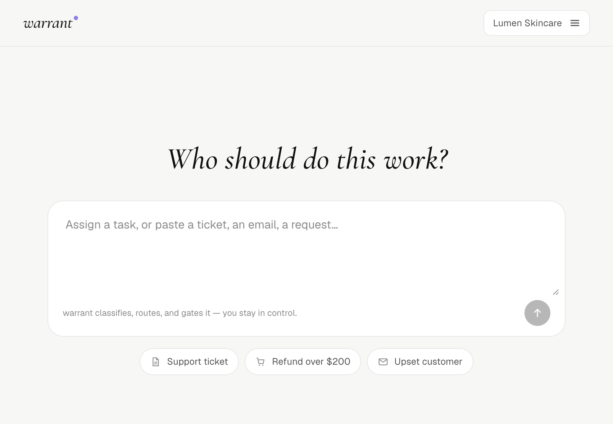
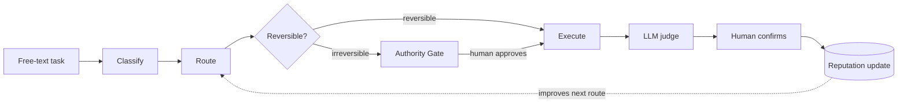
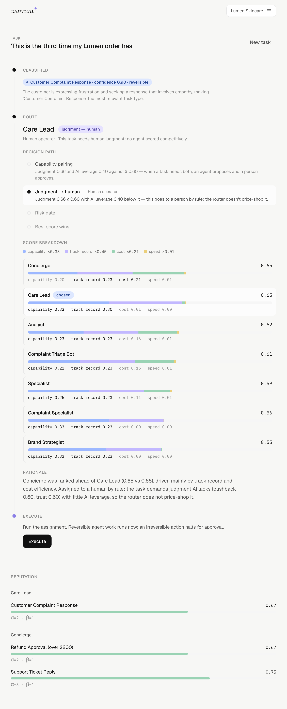
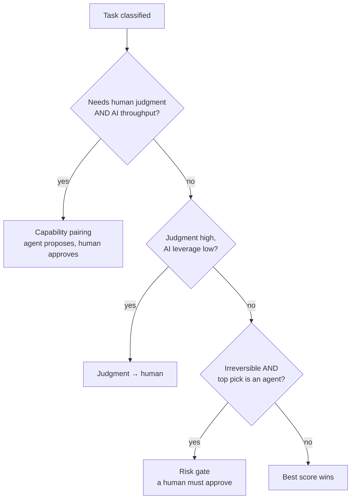
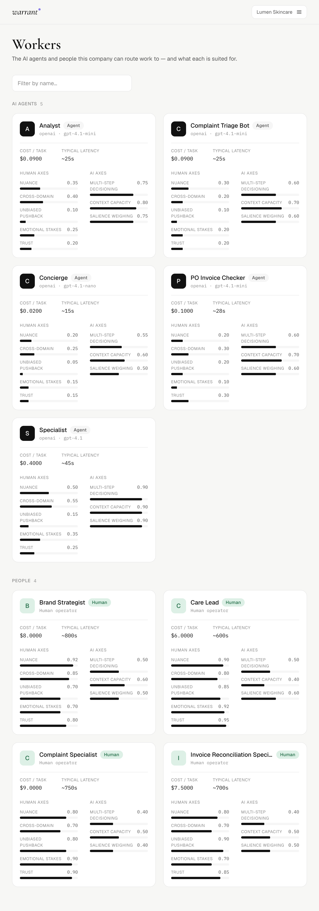
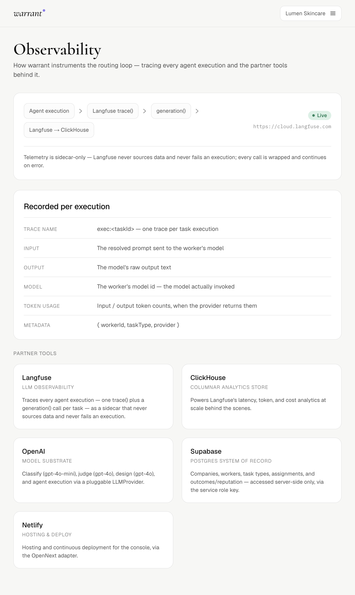

<div align="center">

# warrant

**An operating system for a workforce of humans and AI agents.**

warrant decides *who should do each piece of work* — a specific AI agent, a human,
or an agent that proposes work for a human to approve. It routes each task through an
interpretable score, gates every irreversible action behind a signed human approval,
and learns which workers to trust from judged, human-confirmed outcomes.


### [Live demo →](https://warrant-agentos.netlify.app)



<sub>Built for the GenAI Fund Agentic AI Build Week (Founder Mode, the “Human-AgentOS” problem).</sub>

</div>

---

## The problem

Every company is turning into a mix of AI agents and people, and the hard question
is no longer *can* AI do a task, but **who should** — cheaply and autonomously by an
agent, or by a person because the task needs judgment or carries irreversible risk.
warrant is the layer that makes that decision explicit, keeps a human in control of
anything that can't be undone, and gets better at it over time.

## How it works

A task arrives as free text and moves through four steps. Every step is visible in the
console rather than hidden in a prompt.



1. **Classify** — an LLM maps the free text to one of the company's task types and its
   reversibility, with a confidence and a short reason.
2. **Route** — the engine scores every worker and runs a trigger cascade to choose a
   worker *and* a mode (agent solo, human solo, or agent-proposes / human-approves).
3. **Execute or gate** — reversible agent work runs immediately; an irreversible agent
   action halts at the authority gate and waits for a signed approval.
4. **Judge & confirm** — an independent LLM judge scores the output against the task
   type's acceptance criteria, a human confirms or overrides that verdict, and the
   confirmation updates the chosen worker's reputation.

## See the reasoning, not a black box

The console shows exactly *why* each task went where it did: the rule that fired, the
live numbers behind it, and every candidate's score broken into its weighted parts.

<div align="center">

</div>

### The routing score

Each candidate gets one score: a weighted sum of four terms, each normalized across the
candidate set.

| Term | Weight | Meaning |
|------|-------:|---------|
| capability match | 0.33 | how well the worker covers what the task type requires (8 axes: 5 human, 3 AI) |
| track record | 0.45 | the worker's learned reliability on this task type (Beta-posterior mean) |
| cost efficiency | 0.21 | log-scaled cost, so sub-cent agent gaps stay visible against dollar human costs |
| speed | 0.01 | typical latency |

Weights were calibrated analytically **before any outcome was observed, then frozen**.
They are never retuned after seeing results.

### The trigger cascade

On top of the score sits a cascade that decides the *mode*. The score then decides the
*worker within that mode*.



> **Worked example.** An angry, loyal customer emails in. The cheap agents actually
> score *higher* than the humans. But the classifier marks it a complaint (high human
> axes, low AI leverage), so the **judgment rule overrides the raw score** and routes it
> to a human care lead. The axes decide the mode; the score decides the worker.

## The authority gate

An irreversible agent action can only execute through one path, which mints an
HMAC-signed `ApprovalToken` bound to the exact `(task, worker)`, carrying a single-use
nonce and a 10-minute freshness window. Verification is timing-safe and never throws on
malformed input. `executeReversible` refuses irreversible work, and `executeIrreversible`
asserts the token matches the task, matches the worker, is fresh, and has not been spent.
**There is no bypass.**

## Reputation that learns

Reliability is a Beta-Bernoulli posterior per `(worker, task type)`. The LLM judge
proposes pass/fail, the human confirms or overrides, and only that human-confirmed
outcome updates the posterior. Reputation never resets, so the routing score improves as
evidence accumulates.

## The console

- **Overview** — the composer (“Who should do this work?”) and the live run trace:
  Classify → Route (decision path + score breakdown) → Execute / Gate → Confirm, with
  reputation alongside.
- **Workers** — a visual roster of the company's AI agents and people, each with its
  backing model, cost, latency, and suitability axes.
- **Design** — describe a new need and warrant proposes agents and task types tailored to
  the **currently selected company**, adding to what it already has, reversibility set honestly.
- **Approvals** — the queue of gated, irreversible actions awaiting a human signature.
- **Observability** — how each partner tool is wired, with a live Langfuse status.
- **Tasks / Policies / Analytics** — the read surface over the routing history.

<details>
<summary><strong>More of the console</strong> — the Workers roster and the Observability tab</summary>

<br/>
<div align="center">

<br/><br/>

</div>

</details>

## Architecture

```
lib/                     the pure engine + LLM helpers + data access
  posterior.ts           Beta-Bernoulli math (update/mean/ci90), validated vs scipy fixtures
  config.ts              frozen ROUTER_WEIGHTS + capability threshold
  types.ts               engine domain types (RoutableTask / RoutableWorker)
  router.ts              route(task, workers, reputationFor): score + trigger cascade
  gate.ts                the Authority Gate: HMAC ApprovalToken mint/verify + dispatch
  reputation.ts          folds confirmed outcomes into per-pair posteriors
  classify.ts / judge.ts OpenAI structured-output helpers (classify a task, judge an output)
  substrate.ts           LLMProvider abstraction (OpenAIProvider shipped) + Langfuse sidecar
  scorer.ts              optional deterministic scorer for the known task types
  repos.ts / supabase.ts server-only, service-role data access
  db-types.ts            tenant row types (Company, Worker, TaskType, Task, Assignment, Outcome)
app/
  page.tsx               Overview: composer + run trace
  workers|design|approvals|observability|analytics|tasks|policies/
  api/                   thin route handlers over lib/pipeline (Zod-validated, uniform _http)
  _components/           the design-system UI kit
scripts/                 seed.ts (sample company) + demo.ts (CLI routing loop)
design/                  the authoritative design system (spec, tokens, components)
```

The engine in `lib/` is pure and I/O-free. `lib/pipeline.ts` wires it to the repos
(database) and the LLM helpers, and the `app/api` routes are thin wrappers over the
pipeline. The frontend talks to the backend only through `app/lib/client.ts`.

## Stack

| Tool | Role in warrant |
|------|-----------------|
| **OpenAI** | The model substrate: classify (`gpt-4o-mini`), judge (`gpt-4o`), design (`gpt-4o`), and agent execution, all behind a pluggable `LLMProvider`. |
| **Supabase** | Postgres system of record for companies, workers, task types, assignments, and outcomes; RLS on, accessed server-side only via the service role. |
| **Langfuse** | Traces every agent execution (one `trace` + `generation` per task) as a sidecar that never sources data and never fails an execution. |
| **ClickHouse** | The columnar store behind Langfuse's latency, token, and cost analytics. |
| **Netlify** | Hosting and continuous deploy via the OpenNext adapter; API routes run as functions. |

## Run it locally

```bash
npm install
cp .env.example .env.local     # fill in your keys (see below)
npm run seed                   # seed the sample company (Lumen Skincare)
npm run dev                    # http://localhost:3000
```

`.env.local` keys (server-side unless prefixed `NEXT_PUBLIC_`):

```
OPENAI_API_KEY                                 # classify / judge / design / agents
SUPABASE_URL, SUPABASE_SERVICE_ROLE_KEY        # server-only data access
NEXT_PUBLIC_SUPABASE_URL, NEXT_PUBLIC_SUPABASE_PUBLISHABLE_KEY
APPROVAL_SIGNING_SECRET                         # signs the authority-gate ApprovalToken
CLASSIFIER_MODEL, JUDGE_MODEL, DESIGN_MODEL     # optional model overrides
LANGFUSE_ENABLED, LANGFUSE_PUBLIC_KEY, LANGFUSE_SECRET_KEY, LANGFUSE_HOST  # optional tracing
```

Tests and `next build` do not require live keys.

| Command | What it does |
|---------|--------------|
| `npm run dev` | Next.js dev server |
| `npm run build` / `npm run start` | production build / serve |
| `npm test` | the engine's Vitest suite (**60 tests**: router, gate, posterior vs scipy, reputation, pipeline, evidence) |
| `npm run lint` | ESLint |
| `npm run seed` | seed the sample company |
| `npm run demo` | run the full routing loop from the CLI |

## Trust and honesty

- **Real executions.** Agents run real OpenAI calls; there are no canned outputs.
- **The gate has no bypass.** Irreversible agent work only runs through a signed,
  single-use, expiring approval bound to the exact task and worker.
- **Reputation only moves on human-confirmed outcomes**, and it never resets.
- **The router weights were frozen before any evidence run**, so results were never used
  to make the routing look good after the fact.
